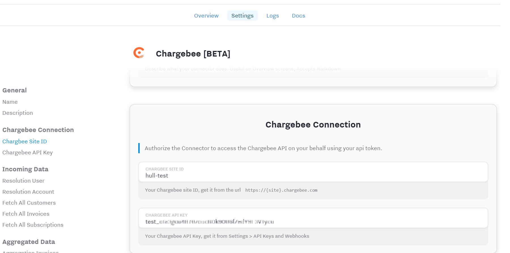
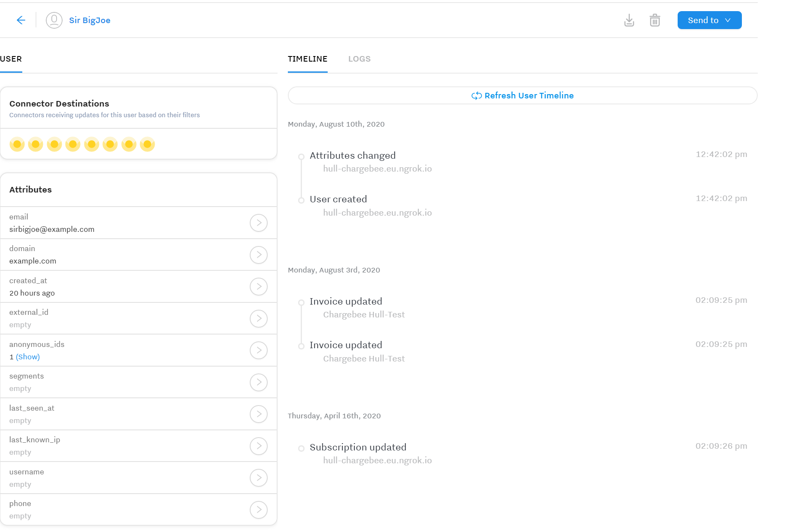
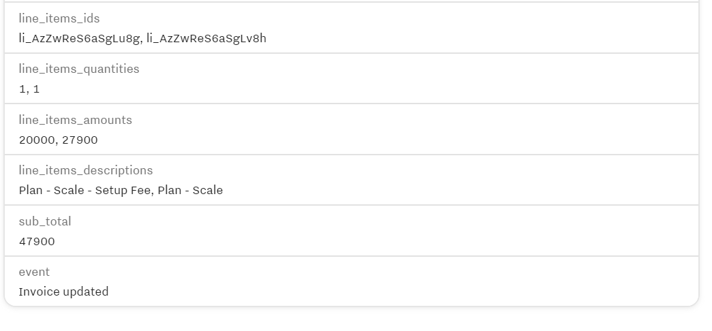
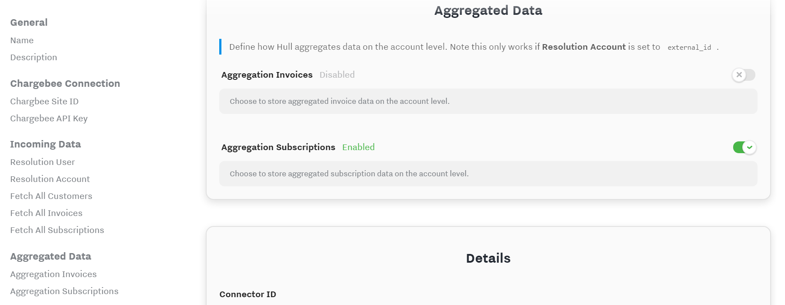

# Hull Chargebee Connector

This Connector enables you to synchronize Chargebee Customers, Invoices and Subscriptions into Hull.

> This is a BETA integration. Please report any issues you may encounter, so we can improve the user experience.

This document was last updated on August 8, 2020. If you want to help us improve this documentation or have some feedback, please feel free to [open a GitHub issue](https://github.com/hull/hull-chargebee/issues/new)!

## Getting Started

1. From your Hull Connectors page click on `[Add a Connector]`
2. Search for "Chargebee" and click on `[Install]`. (Note: This is a Beta Connector and currently not in the gallery yet, you can install it instead by using `hull-chargebee-staging.herokuapp.com` in the "add your own connector card" instead.)
3. Authorize Hull to connect on your behalf to Chargebee by entering the Site ID and API Key.

### Control Incoming Data Flow

#### Fetching of Customers

You can synchronize Chargebee customers to Hull users and/or accounts. To do so, specify the identity resolution strategy for your preferred object. This Connector uses the following simplified resolution strategies:

| Strategy      | Supported Object Types | Description                                               |
| ------------- | ---------------------- | --------------------------------------------------------- |
| `none`        | `account` and `user`   | Does not fetch data for the given object type.            |
| `external_id` | `account` and `user`   | Does resolve the Chargebee ID to the external_id in Hull. |
| `email`       | `user` only            | Does resolve the Chargebee Email to the email in Hull.    |

Note: You can synchronize data to both objects at the same time using different strategies. If you want to use aggregated data on the account-level, you have to select `external_id` for the account strategy.

#### Fetching of Invoices

Invoices are fetched as `Invoice updated` events on the users timeline if you have an identity resolution strategy selected:

Invoices in Chargbee contain a lot of data which doesn't fit the data model in Hull, hence certain information is excluded. In particular, the following detailed data is **excluded**:

- discounts
- taxes
- line_item_discounts
- line_item_taxes
- line_item_tiers
- linked_payments
- dunning_attempts
- applied_credits
- adjustment_credit_notes
- issued_credit_notes

Line items and linked orders are simplified, so you can still use them for segmentation purposes:

You can also fetch an **aggregation of invoices** on the account level, by opting into this feature:

> **IMPORTANT**: You have to use the `external_id` strategy for accounts to use aggregated data, otherwise enabling this setting will not have any effect.

This will store the first and latest invoice on the account level, under the attribute groups `chargebee_first_invoice` and `chargebee_latest_invoice`.

#### Fetching of Subscriptions

Subscriptions are fetched as `Subscription created` or `Subscription updated` events on the users timeline if you have an identity resolution startegy selected:

Note: `Subscription created` events won't be generated when fetching historical data, since only the latest version of a subscription can be retrieved on scale.

As for Invoices, Subscriptions in Chargebee contain a lot of data which doesn't fit the data model in Hull, hence certain information is simplified as well so it is usable for segmentation purposes. In particular addons, event based addons and coupons data is simplified.

You can also fetch an **aggreation of subscriptions** on the account level, by opting into this feature:

Please do note that you can only fetch up to 5 subscriptions. If a Customer in Chargbee has more than 5 subscriptions, the Connector will sample the data, and fetch only the first 5 and the latest subscription. Subscriptions are stored on the account level under attribute groups named `chargebee_subscription_<COUNTER>` where `<COUNTER>` is an incremental number starting with 0 (zero).

> **IMPORTANT**: You have to use the `external_id` strategy for accounts to use aggregated data, otherwise enabling this setting will not have any effect.

#### Fetch Interval and Manual Fetch of Historical Data

The fetch interval for this connector is 5 minutes, which means customers, invoices and subscriptions are automatically synchronized every 5 minutes. The first automated fetch will automatically fetch data from the past hour. You should therefore fetch historical data once after configuring the connector with the buttons in the Incoming Data section of the Settings.

You can perform a full fetch any time, by navigating to the Incoming Data section of the Connector Settings and selecting the objects to synchronize.

**Note**: This behavior changed with version 1.0.8 of the connector. Previous versions synchronized data only every 30 minutes.

## FAQ

### Why can I not use custom metadata to resolve identities

There is no discovery endpoint for metadata on the Chargebee API, hence you can only use well-defined identifiers to prevent errors. If you have custom metadata which matches identifiers in Hull, it is recommended to use the `email` strategy for users and apply post-processing in the Processor yourself.

### Why is the interval 5 minutes for fetching data from Chargebee

While we always strive to make integrations as uniform as possible, there are API limitations we have to take into account. Especially for the data aggregation feature of this connector. If you need data more instantanious, you should set up a webhook in Chargebee and point it to an Incoming Webhooks Connector and implement the necessary logic there.

**Note**: This behavior changed with version 1.0.8 of the connector. Previous versions synchronized data only every 30 minutes.

### Where can I find the changelog for the Connector

You can find the changelog on GitHub detailing what features have been added, what bugfixes have been applied and what technical maintenance measures have been taken: [Changelog](https://github.com/hull/hull-chargebee/blob/master/CHANGELOG.md).

### This Connector is labelled as Beta, is it safe to use

The Connector is tested against a Chargebee test account, however we have no extensive operational track record for it, so there might be errors or unpredictable behavior on large load scenarios. We do appreciate any feedback or feature requests to improve it over time and bring it to a state where we can say with confidence it meets our general availability guidelines.
